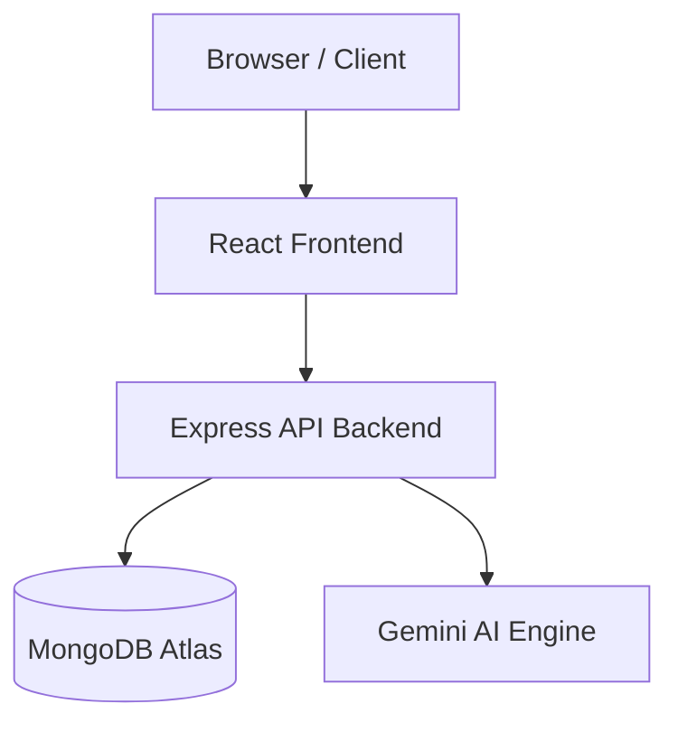
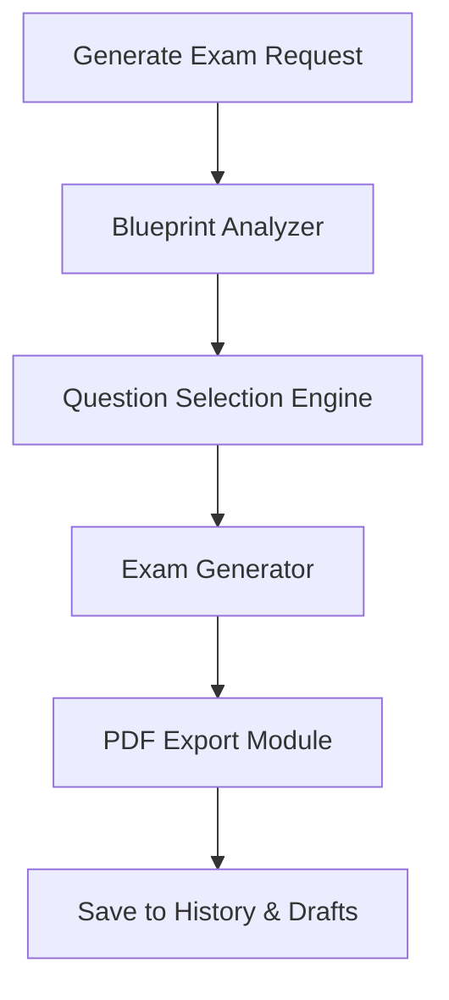

# ExamFlow Architecture

## High-Level Architecture

The following diagram illustrates the high-level architecture of ExamFlow, showing how the different components interact.

## Internal Architecture

The internal flow of the core "Generate Exam" feature, highlighting the AI integration and PDF generation process.

