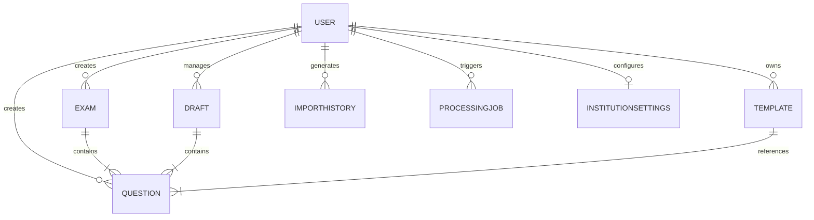

# Database Schema & Data Models

ExamFlow relies on a robust MongoDB schema designed for high-performance querying and efficient document storage, especially for the complex rich-text and hierarchical structure of questions and exams.

## Entity-Relationship Diagram

## Collections & Indexes

### 1. `users`
**Purpose:** Handles authentication and authorization.
- **Estimated Size:** ~1-2 KB per document.
- **Indexes:**
  - `email` (Unique)

### 2. `questions`
**Purpose:** The core entity storing rich text content, metadata, and analytics.
- **Estimated Size:** ~5-15 KB per document (depending on TipTap JSON size).
- **Key Fields:** `questionText`, `options`, `subject`, `topic`, `difficulty`, `qualityScore`, `bloomLevel`.
- **Indexes:**
  - **Text Index:** `{ 'questionText.plainText': 'text', subject: 'text', topic: 'text', subTopic: 'text', tags: 'text', 'explanation.plainText': 'text', keywords: 'text' }` for lightning-fast global searches.
  - **Compound Index:** `{ user: 1, subject: 1, difficulty: 1, type: 1, status: 1 }` to optimize dashboard filtering.
  - **Sort Index:** `{ user: 1, createdAt: -1 }` for recent items queries.

### 3. `exams`
**Purpose:** Stores generated exams and their associated blueprint configuration.
- **Estimated Size:** ~20-50 KB per document (can be large due to embedded question references or snapshots).
- **Key Fields:** `title`, `description`, `blueprint` (JSON configuration), `questions` (Array of ObjectIds), `status`.
- **Indexes:**
  - `{ user: 1, createdAt: -1 }`

### 4. `templates`
**Purpose:** Stores reusable exam blueprint templates.
- **Estimated Size:** ~2-5 KB per document.
- **Indexes:**
  - `{ user: 1 }`

### 5. `drafts`
**Purpose:** Handles auto-saving and temporary states for exams/questions.
- **Estimated Size:** Variable.
- **Indexes:**
  - `{ user: 1, entityId: 1 }`

### 6. `importhistories`
**Purpose:** Audit logs for bulk import jobs via CSV/Excel.
- **Estimated Size:** ~1-3 KB per document.
- **Indexes:**
  - `{ user: 1, createdAt: -1 }`

### 7. `processjobs`
**Purpose:** Tracks background AI processing tasks (e.g. bulk quality analysis).
- **Estimated Size:** ~1-2 KB per document.
- **Indexes:**
  - `{ status: 1, createdAt: -1 }`

### 8. `institutionsettings`
**Purpose:** Global configuration for an institution or tenant.
- **Estimated Size:** ~1-2 KB per document.
- **Indexes:**
  - `{ user: 1 }` (Unique)
